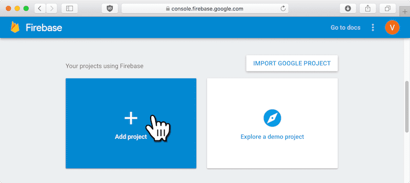
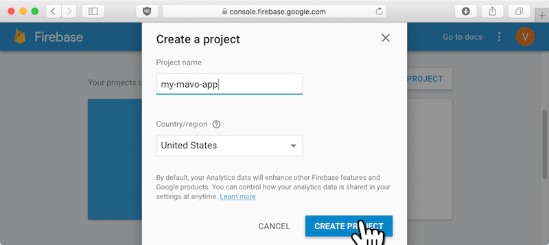
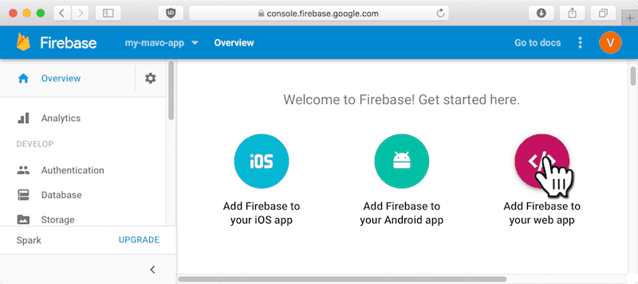
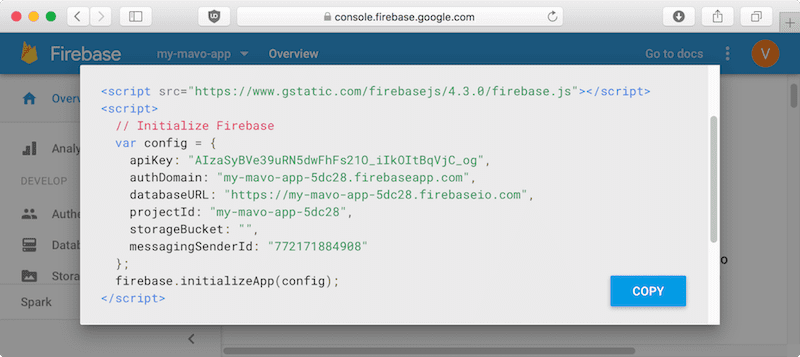
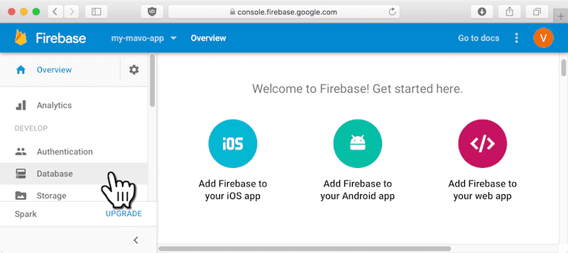
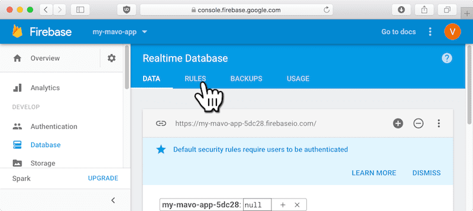
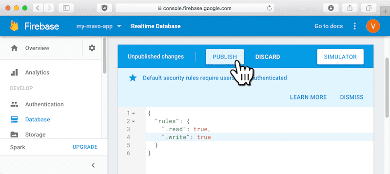

# Mavo-firebase

A Firebase backend plugin for [Mavo](https://mavo.io) that allows realtime data.

Mavo-firebase is made to work with [mavo-offline](https://github.com/valterkraemer/mavo-offline) that caches data and makes Mavo continue to work when going offline.

Requirements:

- [Mavo](https://mavo.io/get/), tested with v0.1.6
- [Firebase Javascript SDK](https://github.com/firebase/firebase-js-sdk), tested with v4.6.2

## Examples

- [To-do list](https://github.com/valterkraemer/mavo-firebase/tree/master/examples/todo) - ([DEMO](https://valterkraemer.github.io/mavo-firebase/examples/todo/))
- [High score (Authentication)](https://github.com/valterkraemer/mavo-firebase/tree/master/examples/authentication) - ([DEMO](https://valterkraemer.github.io/mavo-firebase/examples/authentication/))
- [Image and video of the day (File upload)](https://github.com/valterkraemer/mavo-firebase/tree/master/examples/file-storage) - ([DEMO](https://valterkraemer.github.io/mavo-firebase/examples/file-storage/))

## Quick setup

1. Add Firebase of your HTML file and initialize it.

**Tip:** *Check out the [Setup Firebase](#setup-firebase) section to find out how to set up a Firebase database.*

```
<script src="https://www.gstatic.com/firebasejs/4.6.2/firebase.js"></script>
<script>
  // Initialize Firebase
  var config = {
    apiKey: "*** apiKey ***",
    authDomain: "*** authDomain ***",
    databaseURL: "*** databaseURL ***",
    projectId: "*** projectId ***",
    storageBucket: "*** storageBucket ***",
    messagingSenderId: "*** messagingSenderId ***"
  }
  firebase.initializeApp(config)
</script>
```

2. Set the following attributes on the Mavo root element (same element as `mv-app`):
- `mv-plugins="firebase"`
- `mv-storage="firebase"`
- `mv-unauthenticated-permissions="read edit save"` if you want unauthenticated users to be able to edit and save.
- `mv-server-push` if you want server pushed updates (Open the page in multiple windows and they will be kept in sync).

```
<main mv-app="todo"
  mv-plugins="firebase"
  mv-storage="firebase"
  mv-unauthenticated-permissions="read edit save"
  mv-server-push="true"
  mv-autosave="0">

  ...
```

## Attributes

| Attribute                        | Description
|:---------------------------------|:------------------------------------------------------------ |
| `mv-storage`                     | **Required** Should be set to `firebase`.                    |
| `mv-server-push`                 | Update data in browser if there is a change in the database. |

#### Initialize Firebase using attributes

You can use attributes instead of script tag to initializing Firebase. This way you can have multiple Mavo applications on the same page using different Firebase databases.

| Attribute                        | Description
|:---------------------------------|:-------------------------------------------------------------------------- |
| `mv-storage`                     | **Required** Database url. E.g. `https://databaseName.firebaseio.com`      |
| `mv-firebase-api-key`            | **Required** Api key. E.g. `AIzaSyD3-4ZXfsdDFGGC7Fdg-ean0VZ36bwoEA`        |
| `mv-firebase-auth-domain`        | Auth domain, needed to enable login. E.g. `projectId.firebaseapp.com`      |
| `mv-firebase-storage-bucket`     | Storage bucket, needed to enable file uploading E.g. `bucket.appspot.com`  |
| `mv-server-push`                 | Push data from server when there are changes.                              |

#### Permission attributes

| Attribute                        | Default                                            | Description                           |
|:-------------------------------- |:-------------------------------------------------- |:------------------------------------- |
| `mv-unauthenticated-permissions` | `read`, also `login` if `authDomain` is specified. | Permissions for unauthenticated users |
| `mv-authenticated-permissions`   | `read edit add delete save logout`                 | Permissions for authenticated users   |

Your Mavo id will be used as name for the root object in database.

## Setup Firebase

Login or signup at https://console.firebase.google.com

### Create a new project





### Get your project's config details

Set the [attributes](#attributes) to the values from the config.





### Setup database rules

We will make the database public so that we can read and write to it.





Set `.read` and `.write` to `true`. Remember to click "Publish".

**Warning:** After this step anyone can read and write to your database.


