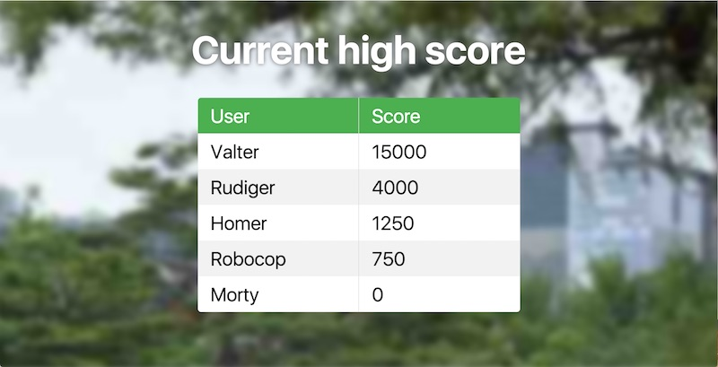
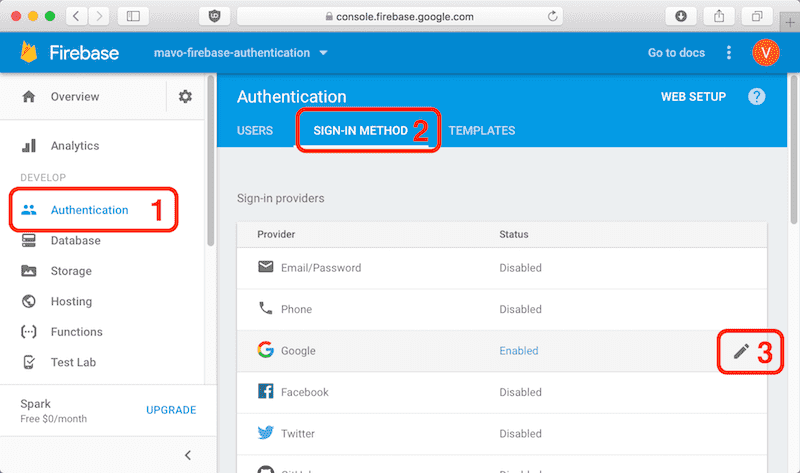
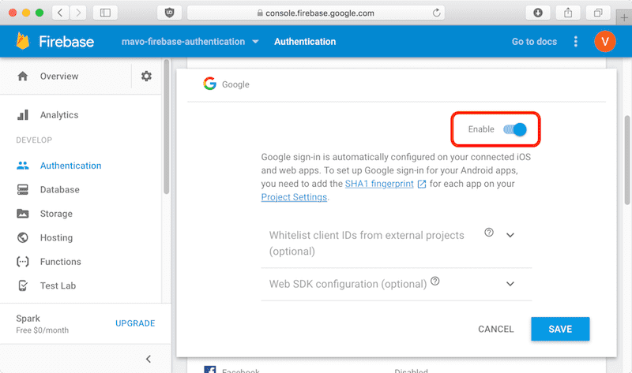
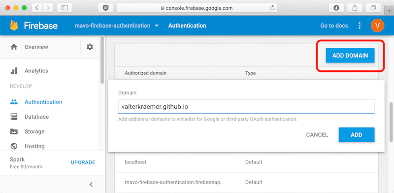
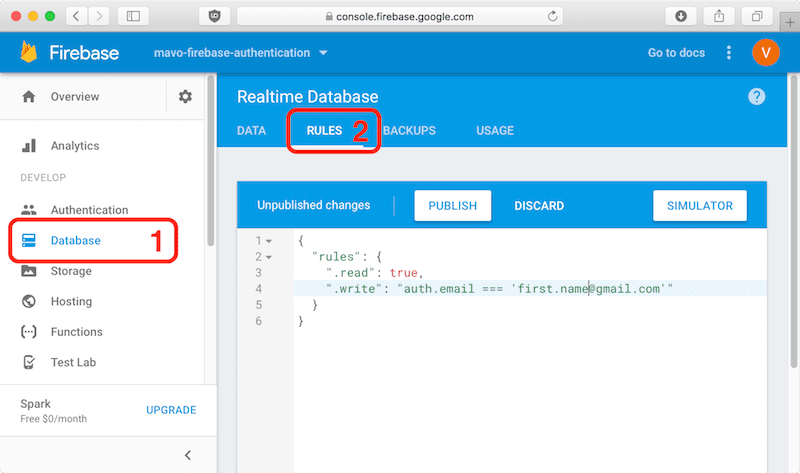

# High score (Authentication)



[View Demo](https://valterkraemer.github.io/mavo-firebase/examples/authentication/)

This example show a high score list where you have to log in to be able to edit it. Because editing is only done by the author the mv-bar is hidden. To login one need to add `?login` to the end of the url (https://valterkraemer.github.io/mavo-firebase/examples/authentication?login).

The browser will probably block sign-in popup so you have to allow popups for domain.

## Setup Firebase

To set up Firebase to require authentication (with Google as sign-in method) follow the following steps.

### Set Google as sign-in method

Open [Firebase console](https://console.firebase.google.com) and go to your project.





### Add authorized domains

Add the domain(s) from where you are going to serve your site.



### Set database rules

Set the database rules to only allow certain email to write, and allow everybody to read.

The Demo allows any logged in user to modify data.

```
{
  "rules": {
    ".read": true,
    ".write": "auth != null"
  }
}
```



